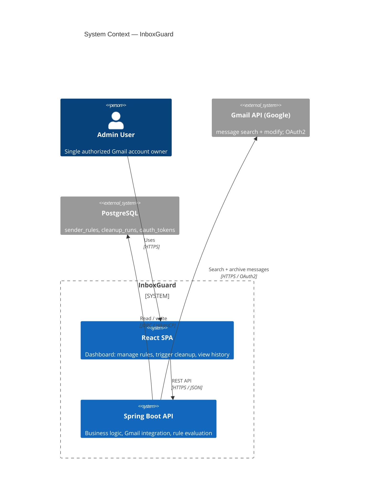
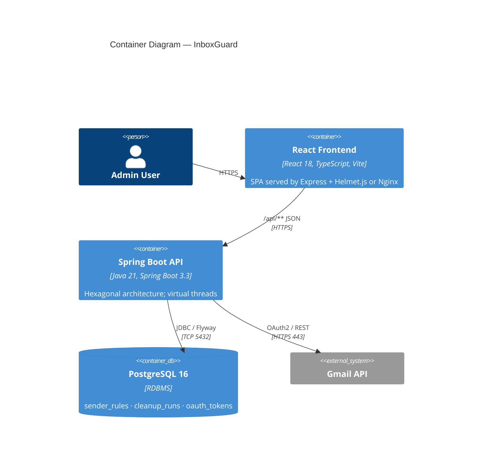
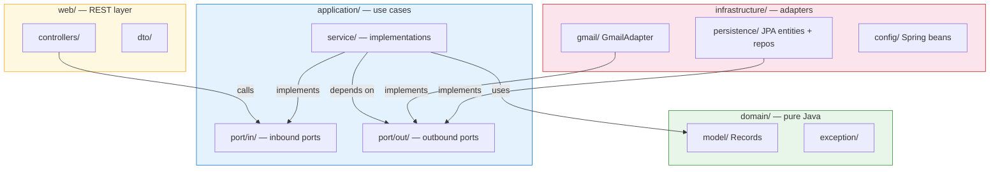
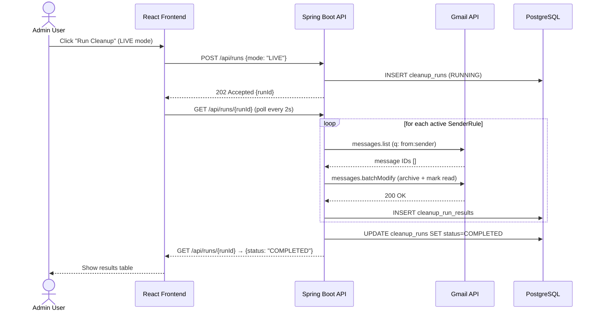

# InboxGuard — Architecture Diagrams

Diagrams are rendered natively in GitHub markdown and Notion via Mermaid.js.
For complex multi-service diagrams see `system.d2` (D2 language, auto-layout).
For formal C4 model docs see `workspace.dsl` (Structurizr Lite).

---

## System Context

---

## Container Diagram

---

## Hexagonal Architecture — Backend Package Layout

---

## Cleanup Run — Sequence Diagram

